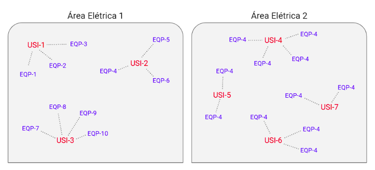
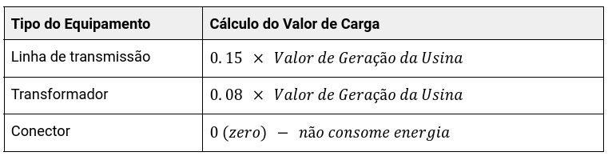
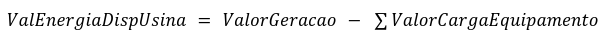
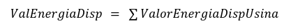
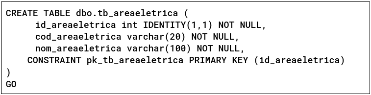
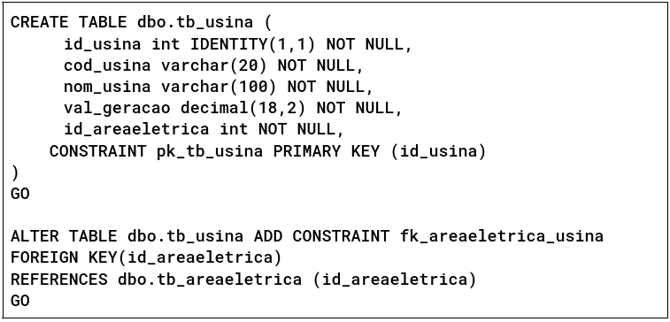
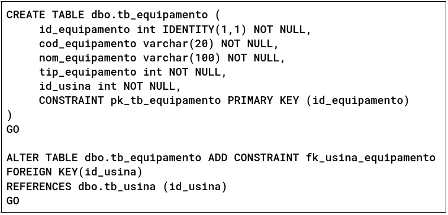

# Sistema de Controle de Disponibilidade de Energia

## Entendendo o Negócio

No sistema energético do país precisamos ter um equilíbrio entre a geração e o consumo de energia. Não devemos deixar sobrar energia gerada e, principalmente, não devemos deixar faltar. Por isso, precisamos ter a visibilidade sobre o quanto de energia está disponível na nossa configuração energética.

Para facilitar esta gestão, o país é dividido em Áreas Elétricas. Cada área elétrica é composta por um conjunto de usinas. E cada usina possui um conjunto de equipamentos relacionados a ela.

Para o nosso contexto de negócio, considere que:

### Usinas

São responsáveis por gerar energia elétrica e possuem as seguintes informações: 

* Código (máximo de 20 caracteres)
* Nome (máximo de 100 caracteres)
* Valor de geração (valor numérico com precisão de duas casas decimais)

Código e nome são informações obrigatórias e duas usinas não podem ter o mesmo código.

Além dessas informações, cada usina possui um conjunto de equipamentos que são alimentados por esta energia gerada.

### Equipamentos

São elementos da rede elétrica que consomem energia. Existem três tipos de equipamentos:

* Linha de transmissão
* Transformador
* Conector

Equipamentos possuem as seguintes informações:

* Código (máximo de 20 caracteres)
* Nome (máximo de 100 caracteres)
* Tipo (1 - Linha de transmissão / 2 - Transformador / 3 - Conector)

Código e nome são informações obrigatórias e dois equipamentos não podem ter o mesmo código.

Todo equipamento possui uma e apenas uma usina relacionada, responsável por gerar a energia que o alimenta. O consumo de energia do equipamento é representado pelo seu valor de carga, que é calculado de acordo com o seu tipo:

### Áreas Elétricas

Região do país composta por um conjunto de usinas e seus equipamentos relacionados. Cada área elétrica possui um Valor de Energia Disponível (ValEnergiaDisp), que é calculado da seguinte forma:

Considere que para cada usina, seu valor de energia disponível (ValEnergiaDispUsina) é calculado da seguinte forma:

Onde,
* ValorGeracao: Valor de geração da usina
* ValorCargaEquipamento: Valor de carga de um equipamento relacionado à usina

Dito isto, devemos calcular o valor de energia disponível de cada usina pertencente à área elétrica e calcular o valor de energia disponível na área da seguinte forma:

Áreas elétricas possuem as seguintes informações:

* Código (máximo de 20 caracteres)
* Nome (máximo de 100 caracteres)

Código e nome são informações obrigatórias e duas áreas elétricas não podem ter o mesmo código.

## Necessidades do Usuário

Diante do contexto de negócio acima, devemos desenvolver um sistema que permita ao usuário:

### Cadastro de Equipamentos

Manter o cadastro de equipamentos. Na lista de equipamentos, o usuário deve visualizar o valor de carga de cada um, de acordo com as regras definidas acima.

### Cadastro de Usinas

Manter o cadastro de usinas. Deve ser possível alterar a lista de equipamentos relacionados.

### Cadastro de Áreas Elétricas

Manter o cadastro de áreas elétricas. Deve ser possível alterar a lista de usinas relacionadas.

Na lista de áreas elétricas cadastradas, o usuário deve visualizar o valor de energia disponível de cada área, de acordo com as regras definidas acima.

O valor de energia disponível deve ser destacado em vermelho sempre que estiver abaixo de zero, pois representa um problema na distribuição de energia.

Considere que em todos os cadastros acima, o usuário gostaria de:

* Listar todos os itens cadastrados
* Incluir novo item
* Alterar ou excluir um item cadastrado

Considere também que, neste momento, não há necessidade de qualquer mecanismo de autenticação ou autorização.

## Solução

Defina a solução técnica e construa uma aplicação web que atenda às necessidades do usuário.

Já temos um banco de dados modelado para atender à aplicação. Você receberá as credenciais de acesso ao banco. 

Estas são as tabelas definidas para esta solução. Se identificar alguma necessidade de evolução neste modelo, fique à vontade.

### Tabela de Áreas Elétricas

### Tabela de Usinas

### Tabela de Equipamentos

